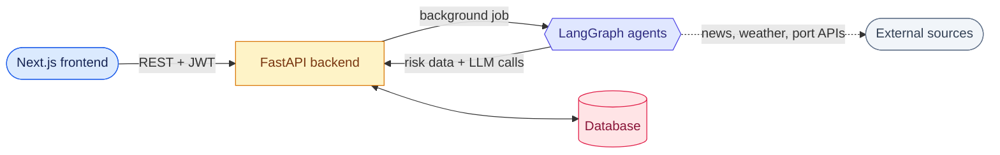
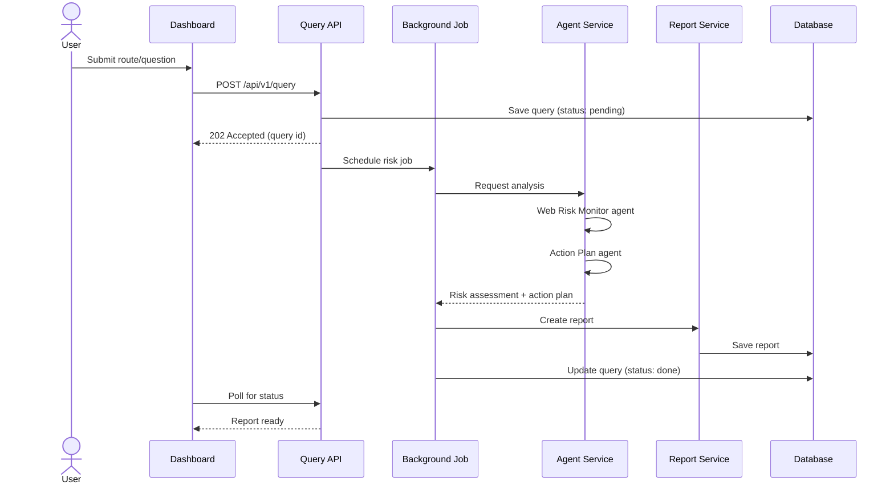

# GlobaLens AI

Multi-agent AI system for monitoring global supply chain risk in real time.

[](https://www.python.org)
[](https://fastapi.tiangolo.com)
[](https://github.com/langchain-ai/langgraph)
[](https://docker.com)
[](LICENSE)

## What it is

GlobaLens AI watches global news, weather, port activity, and geopolitical events, and turns that into a risk score and a suggested action plan for a given shipping route or supplier.

It started as a submission for HackTheAI 2025 and has kept evolving since — the biggest change being a move off the original no-code agent builder (SmythOS) and onto a self-hosted agent graph built with LangGraph, which gives full control over how agents share state and call tools instead of depending on someone else's platform.

The core idea stays the same: instead of a logistics team manually scanning news and weather reports for disruptions, a set of AI agents does the scanning and hands back a structured risk assessment plus concrete mitigation steps.

## Features

- **Automated risk monitoring** — a Web Risk Monitor agent pulls from news, weather, and port-status sources and summarizes what's relevant to a given route
- **Action plan generation** — an Action Plan agent turns that risk assessment into a ranked list of mitigation steps
- **Risk dashboard** — route heatmap, a timeline of how risk has changed, and alerts when something crosses a threshold
- **History and analytics views** — look back at past queries and reports, not just the latest one
- **Exportable reports** — PDF/CSV output for sharing with stakeholders who don't want to open the dashboard
- **JWT-based auth** and an async FastAPI backend so requests don't block while agents are working

## Architecture

At a glance, it's a fairly standard setup — a Next.js frontend, a FastAPI backend, and an agent layer that the backend calls into for the actual intelligence work:



The part worth calling out: the API layer never talks to news/weather/port sources directly — it hands the question to the agent layer and gets back structured results. That's what makes it possible to swap the agent framework (SmythOS → LangGraph) without touching the rest of the backend.

**Request flow** — what actually happens when someone runs a query:



<details>
<summary><strong>Full component diagram</strong> (click to expand — maps directly to the file structure below)</summary>



```mermaid
flowchart TD

subgraph group_client["Client Experience"]
  node_login["Login Signup<br/>[page.tsx]"]
  node_dashboard["Risk Dashboard<br/>[page.tsx]"]
  node_analytics["Analytics View<br/>[page.tsx]"]
  node_history["History View<br/>[page.tsx]"]
end

subgraph group_api["FastAPI Backend"]
  node_fastapi["FastAPI Application<br/>[main.py]"]
  node_auth_routes["Auth Routes<br/>[auth.py]"]
  node_query_routes["Query Routes<br/>[query.py]"]
  node_report_routes["Report Routes<br/>[report.py]"]
  node_auth_core["JWT Authentication<br/>[auth.py]"]
  node_query_service["Query Service<br/>[query_service.py]"]
  node_error_handler["Error Handling<br/>[error_handler.py]"]
end

subgraph group_intelligence["Risk Intelligence"]
  node_risk_job["Background Risk Job<br/>[query.py]"]
  node_agent_service["Agent Service<br/>[agent_service.py]"]
  node_report_service["Report Service<br/>[report_service.py]"]
end

subgraph group_persistence["Data Persistence"]
  node_user_store[("User Store<br/>[user.py]")]
  node_query_store[("Query Store<br/>[query.py]")]
  node_report_store[("Report Store<br/>[report.py]")]
  node_database[("SQL Database<br/>[database.py]")]
end

node_user(("Logistics User"))
node_risk_agent["Web Risk Monitor"]
node_action_agent["Action Plan Agent"]

node_user -->|"opens client"| node_login
node_login -->|"authenticates"| node_auth_routes
node_auth_routes -->|"validates tokens"| node_auth_core
node_auth_routes -->|"reads users"| node_user_store
node_fastapi -->|"dispatches auth"| node_auth_routes
node_fastapi -->|"dispatches queries"| node_query_routes
node_fastapi -->|"dispatches reports"| node_report_routes
node_fastapi -->|"registers handlers"| node_error_handler
node_user -->|"submits question"| node_dashboard
node_dashboard -->|"creates queries"| node_query_routes
node_query_routes -->|"creates query"| node_query_service
node_query_service -->|"writes query"| node_query_store
node_query_routes -->|"schedules processing"| node_risk_job
node_risk_job -->|"updates status"| node_query_service
node_risk_job -->|"requests analysis"| node_agent_service
node_agent_service -.->|"monitors risks"| node_risk_agent
node_agent_service -.->|"generates actions"| node_action_agent
node_risk_job -->|"creates reports"| node_report_service
node_report_service -->|"writes reports"| node_report_store
node_report_routes -->|"retrieves reports"| node_report_service
node_history -->|"loads history"| node_query_routes
node_analytics -->|"loads insights"| node_report_routes
node_dashboard -->|"polls status"| node_query_routes
node_database -->|"stores records"| node_user_store
node_database -->|"stores records"| node_query_store
node_database -->|"stores records"| node_report_store

classDef toneBlue fill:#dbeafe,stroke:#2563eb,stroke-width:1.5px,color:#172554
classDef toneAmber fill:#fef3c7,stroke:#d97706,stroke-width:1.5px,color:#78350f
classDef toneMint fill:#dcfce7,stroke:#16a34a,stroke-width:1.5px,color:#14532d
classDef toneRose fill:#ffe4e6,stroke:#e11d48,stroke-width:1.5px,color:#881337
classDef toneIndigo fill:#e0e7ff,stroke:#4f46e5,stroke-width:1.5px,color:#312e81
class node_login,node_dashboard,node_analytics,node_history,node_user toneBlue
class node_fastapi,node_auth_routes,node_query_routes,node_report_routes,node_auth_core,node_query_service,node_error_handler toneAmber
class node_risk_job,node_agent_service,node_report_service toneMint
class node_user_store,node_query_store,node_report_store,node_database toneRose
class node_risk_agent,node_action_agent toneIndigo
```

**Legend:** 🔵 client/UI · 🟡 API layer (routes, auth, error handling) · 🟢 background processing (jobs, agent service, reports) · 🔴 persistence · 🟣 agents

</details>

## Tech stack

**Backend**
- FastAPI, SQLAlchemy, Pydantic
- JWT auth (`core/auth.py`)
- SQLite for development (Postgres-ready)

**Frontend**
- Next.js — login/signup, risk dashboard, analytics, and history views

**Agents / AI**
- [LangGraph](https://github.com/langchain-ai/langgraph) orchestrates the Web Risk Monitor and Action Plan agents as a stateful graph, with checkpointing so a long-running query can resume instead of restarting
- An LLM provider of your choice for the underlying reasoning (OpenAI, Anthropic, or a local model via Ollama — configure via `.env`)

**Infra**
- Docker + docker-compose for local dev and deploy

## Getting started

### Docker (recommended)

```bash
git clone https://github.com/m3hrab/GlobaLens-AI.git
cd GlobaLens-AI/backend
docker-compose up --build
```

API will be at `http://localhost:8000`, docs at `http://localhost:8000/docs`.

### Local dev

```bash
cd backend
python3 -m venv venv
source venv/bin/activate
pip install -r requirements.txt
uvicorn app.main:app --reload
```

### Frontend

```bash
cd frontend
npm install
npm run dev
```

### Environment variables

```bash
cp .env.example .env
# then set your LLM provider key (OPENAI_API_KEY, ANTHROPIC_API_KEY, etc.)
# and DATABASE_URL if you're not using the SQLite default
```

## API overview

| Endpoint | Description |
|---|---|
| `POST /api/v1/auth/signup` | Register a user |
| `POST /api/v1/auth/login` | Log in, get a JWT |
| `POST /api/v1/query/` | Kick off a risk analysis (async) |
| `GET /api/v1/query/{id}` | Check status / get results |
| `GET /api/v1/report/{id}/risk-analysis` | Full risk breakdown |
| `POST /api/v1/report/{id}/action-plan` | Generate mitigation steps |

Full OpenAPI docs are served at `/docs` once the server is running.

## Project structure

```
GlobaLens-AI/
├── backend/
│   ├── app/
│   │   ├── main.py                     # FastAPI app, route registration
│   │   ├── core/
│   │   │   ├── auth.py                 # JWT auth
│   │   │   └── database.py             # DB session/engine
│   │   ├── models/
│   │   │   ├── user.py
│   │   │   ├── query.py
│   │   │   └── report.py
│   │   ├── services/
│   │   │   ├── query_service.py        # query lifecycle
│   │   │   ├── agent_service.py        # calls into the LangGraph agents
│   │   │   └── report_service.py       # report generation/storage
│   │   ├── routes/
│   │   │   ├── auth.py
│   │   │   ├── query.py                # includes the background risk job
│   │   │   └── report.py
│   │   └── middleware/
│   │       └── error_handler.py
│   ├── Dockerfile
│   └── docker-compose.yml
├── frontend/
│   └── src/app/
│       ├── login/page.tsx
│       ├── dashboard/page.tsx
│       ├── analytics/page.tsx
│       └── history/page.tsx
├── docs/                                # architecture notes, API examples
├── LICENSE
└── README.md
```

## Status / roadmap

This is a working prototype, not a finished product. Some things on the list:

- [ ] Finish out the analytics view (currently basic)
- [ ] Swap SQLite for Postgres by default
- [ ] Add more data sources beyond news/weather (customs data, carrier APIs)
- [ ] Write proper test coverage for the agent graph
- [ ] Stream partial agent output to the frontend instead of polling

## Contributing

This project is open source and contributions are welcome — bug fixes, new data sources, a better frontend, or improvements to the agent graph. Open an issue first for anything non-trivial so we can talk through the approach before you sink time into it.

1. Fork the repo
2. Create a branch (`git checkout -b feature/thing`)
3. Commit your changes
4. Open a PR

## License

MIT — see [LICENSE](LICENSE).

## Team

Built for HackTheAI 2025 by Team BUBT_Droptouts.

- **Mehrab Hossain** — [@m3hrab](https://github.com/m3hrab)
- **Zehad Khan** — [@zehadkhan](https://github.com/zehadkhan)

Repo: [github.com/m3hrab/GlobaLens-AI](https://github.com/m3hrab/GlobaLens-AI)
